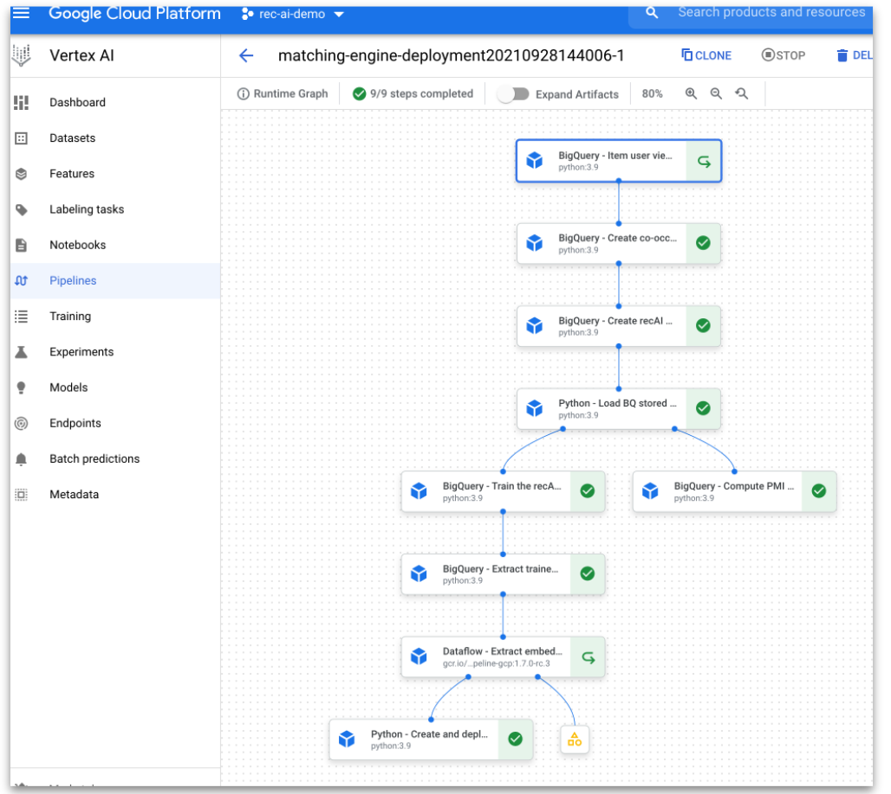

# BigQueryML RecAI Implementation with Matching Engine and Vertex Pipelines

The purpose of this section is to guide the user through creation of new indices on Matchining engine. Also, there is an indpendendent section to automate the entire process using Vertex pipelines. 

Heavy adaptation from [this repo](https://github.com/GoogleCloudPlatform/analytics-componentized-patterns/tree/master/retail/recommendation-system/bqml-scann)
_______

### 00 Prep Bigquery
* Create views for product-user pairs
* Prep the stored procedures
* Create
* Loading data into datastore (unneccessary but could extend recommendations to be integrated in a simulated prod)

### 01 Train BQML
* Trains the item matching model
* Some analysis on top products

### 02 Dataflow embedding files to GCS
* Export the embeddings using dataflow API
* Export from BQML table to GCS
* Product embeddings

### 03 Matching Engine
* Shorter section on simple tensorflow implementation
* Not used in Vertex Pipelines (but could be extended)

### 04 Vertex pipeline setup
* Infrastrucure setup (VPC, etc..)
* BQML Flex slot reservations (needed for training)
* API enablement
* Dataflow Vertex pipeline component

_______

## Instructions for running Vertex Pipelines from new project
1. Begin by running the instructions below to terraform the environment, data
2. Start from [04_setup_pipeline_resources](3.bqml-scann/04_setup_pipeline_resources.ipynb)

# Terraforming new environment (do this first if new project)
___
> Refactored code base sourced from
> [go/recommendation-ai-demo-instructions](http://go/recommendation-ai-demo-instructions)  
> Most interactions are now scripted and modification to one configuration file in 0.setup

## Instructions

---
> General flow is to step through the directories, update the configurations and execute scripts and process.  
> Most configuration has been pushed into `./0.setup/env_vars.sh` and `./0.setup/install_packages.sh`  
> Each section assumes you are executing commands from the relative directory of each section

### 0.setup 
> Install packages and update variables
1. Install cloud sdk, git, npm, and angular cli  
    `bash install_packages.sh`
2. Configure environment variables according to your desires  
    `vi env_vars.sh`
3. Export variables for continued usage in subsequent steps  
    `source env_vars.sh`
4. Ensure required API's are enabled in Google Cloud Console and create Terraform service account  
   `bash gcp_project_prep.sh`  

### 1.terraform
> main.tf is configured to build Service Accounts, Networking, AppEngine, Cloud SQL, Storage buckets, and Big Query Datasets
1. Export Service Account Credentials path variable  
    `export GOOGLE_APPLICATION_CREDENTIALS=./service_account.json`
2. Initialize terraform for the current project  
    `terraform init`
3. Execute the plan step to review the full set of changes to be applied  
    `terraform plan`
4. After review, apply terraform spec to build the environment  
    `terraform apply`

### 2.dataprep
> Create schema in Cloud SQL and copy the css_retail dataset in Big Query
1. Execute Big Query copy and export script  
    `bash copy_retail_dataset_bigquery.sh`